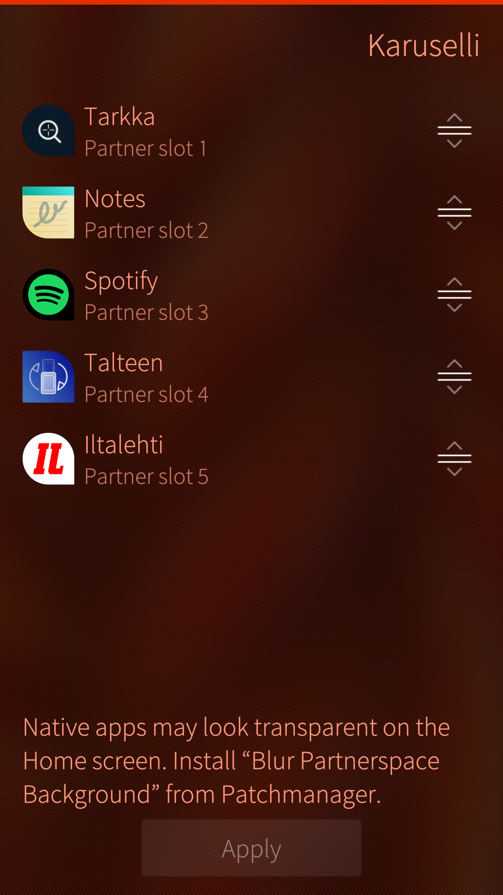

# Karuselli

Karuselli lets you customize the Sailfish OS **partner space** — the carousel of apps below the clock on the Home screen. Choose up to five apps, reorder them, and apply your layout with one tap.

 

 

## Features

- Enable or disable the partner space.
- Pick up to five apps from installed applications.
- Drag to reorder; remove apps with a remorse swipe.
- Apply changes to dconf; restart the Home screen only when turning the partner space on.

## Using Karuselli

See [Using Karuselli](docs/guide.md) for step-by-step instructions.

## Builds

Install **Karuselli partnerspace** from [OpenRepos](https://openrepos.net/content/fravaccaro/karuselli-partnerspace).

RPM packages for **aarch64**, **armv7hl**, and **i486** are also built by GitHub Actions on each push to `main`. Download the latest build from [GitHub Releases](https://github.com/fravaccaro/harbour-karuselli/releases) or the workflow artifacts on [Actions](https://github.com/fravaccaro/harbour-karuselli/actions).

## Source

[github.com/fravaccaro/harbour-karuselli](https://github.com/fravaccaro/harbour-karuselli)
